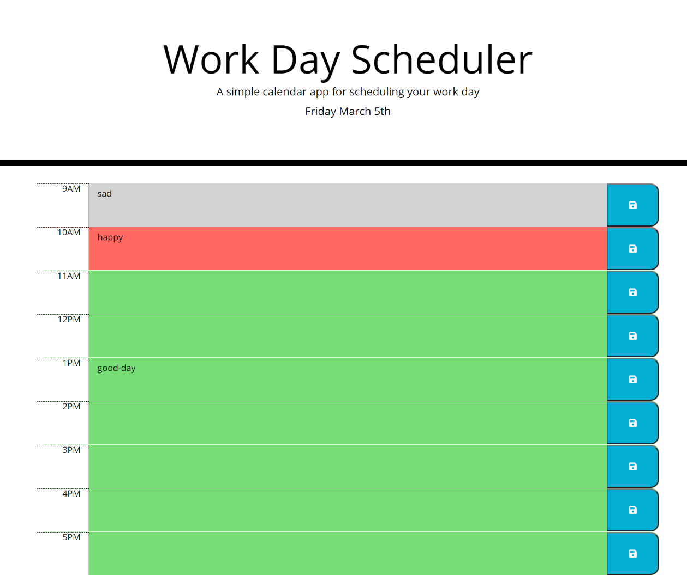

# Work Day Planner

---

A calendar application for a single work day that allows users to save events for each hour. You will find that the app will run in the browser and features dynamic HTML and CSS utilizing Javascript, jQuery, and Moment.js.

&nbsp;

## Links

---

&nbsp;

[Deployed Application URL]( https://cmcunningham27.github.io/work-day-planner/)

[GitHub Repository URL](https://github.com/cmcunningham27/work-day-planner)

&nbsp;

## The following image shows how the webpage appears on a desktop after a password has been generated

---

&nbsp;

&nbsp;

## About the Project

---

&nbsp;

I needed to create a daily work scheduler for users. In order to do this I needed to create a Bootstrap Grid System by using a container, and adding 9 rows. Each row needed classes with columns. Each rown has a div tag for the row's time, textarea tag for their event they wish to add and save, and a button tag to save their event. I then created a set interval function in the javascript so when the document is ready it continuously keeps track of the hour every second. To have the date printed immediately upon the the user opening the page I needed to have it outside of the set interval function.

&nbsp;

I then applied an event listener for the save buttons on each row to store their event with its corresponding time into their local storage for later use. Following that I have get item for each hour available in the 9-5 work day in order to print their past events that were stored, if they had some already. 

&nbsp;

Lastly, A function was created to turn the current hour and each rows hour id into integers set an argument on whether the hour was in the past, present, or future. If it was in the past then it turns gray, present hour is red, and future hours are green. 

&nbsp;

## Complications I Came Across

---
&nbsp;

Knowing how to create a set interval function correctly was a challenge as there are many ways to do so. The greatest challenge I came across was trying to figure out how to have the row colors update each hour the window is open. I tried it in the set interval function, but that did not work. I know it is not a feature that was requested, but I wanted to achieve it. 

&nbsp;

The other challenge I ran into was how to use an argument to change the colors. I did not think of turning the id and the moment hour into integers to compare them. I have not used parseInt often enough yet to recall its use. 

&nbsp;

## How the User Can Use the Website

---

&nbsp;

When the user opens the page they will immediately be told what the day of the week, the month, and day in the month it the day they visit. They will see 9 rows showing times from 9AM-5Pm. In the gray, red, and green areas they can click and type in an event for the day that they wish to save and remember. Once they have entered their event they then click the blue button on the right with the save icon. This will store their event in their local storage found in Dev Tools in the Applications tab. Their daily events will remain when they refresh the page in order to make sure any events are not forgotten.

&nbsp;

## Credits

---

&nbsp;

Cassandra Cunningham, https://github.com/cmcunningham27